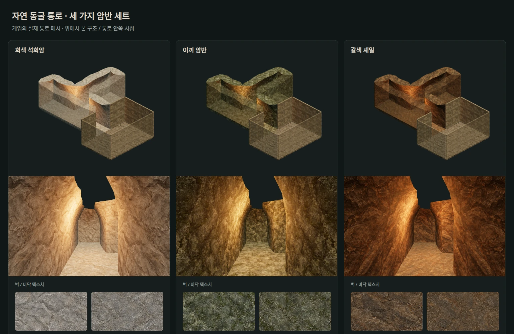
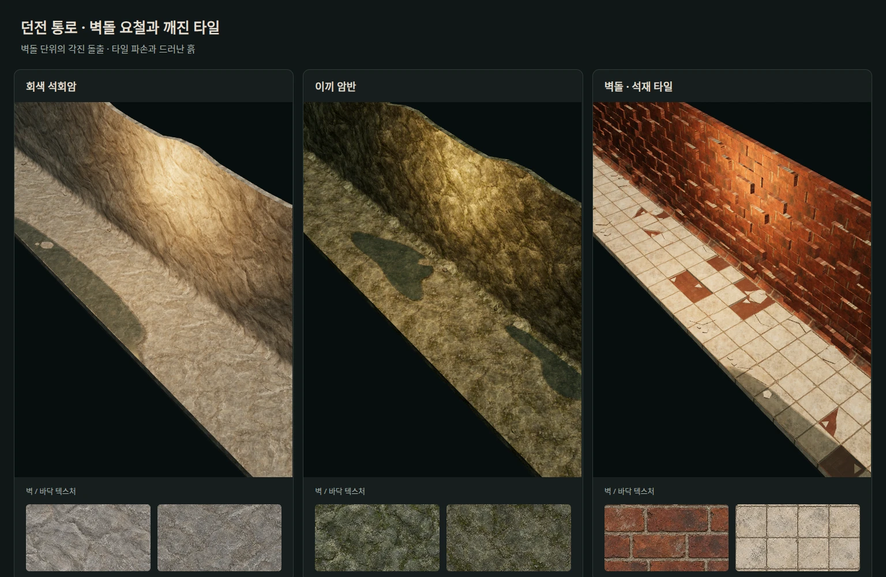
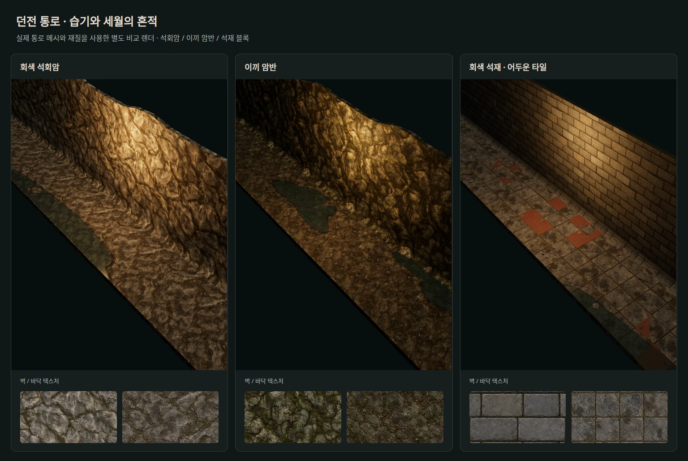
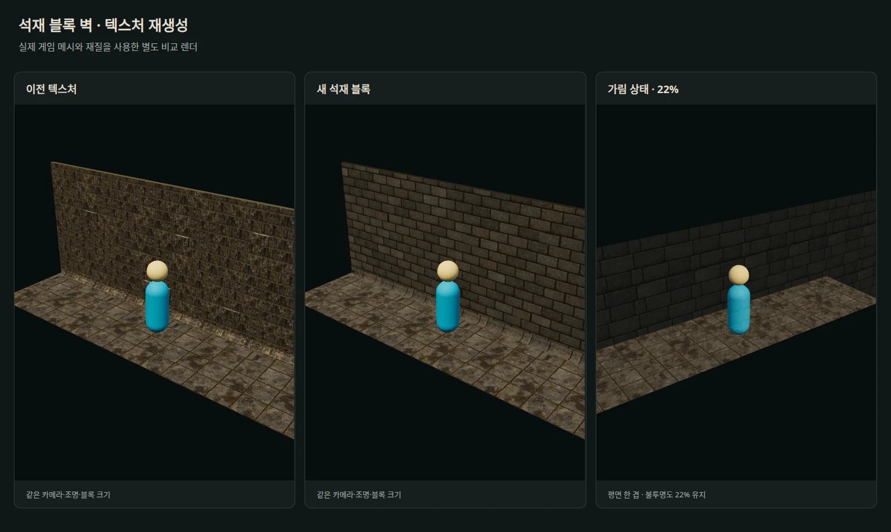
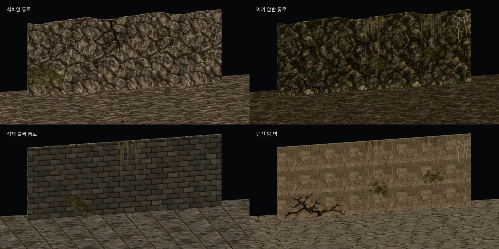
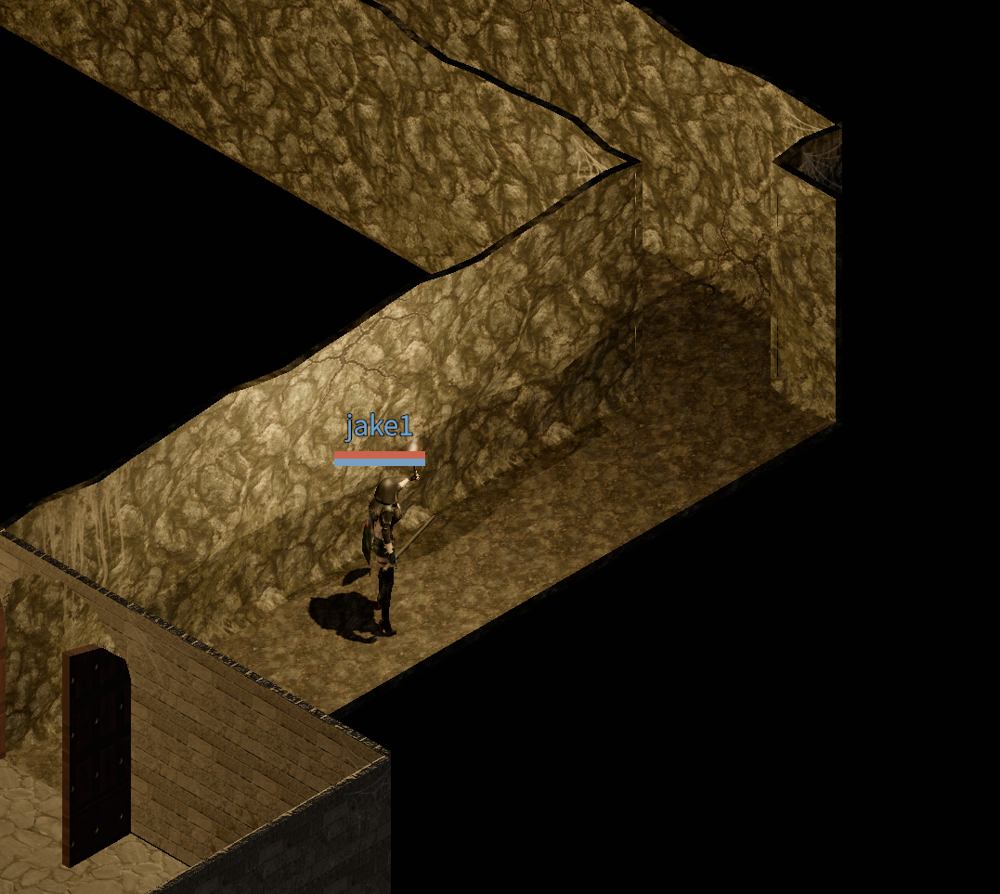
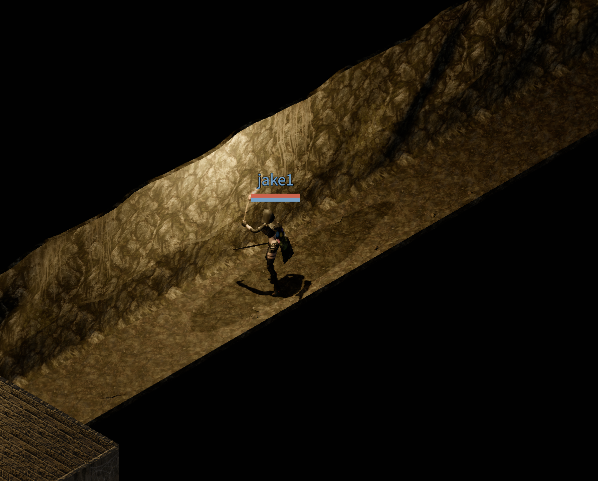
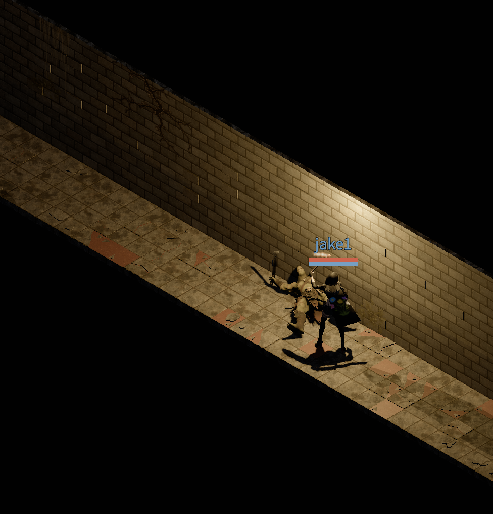

던전의 벽과 바닥 텍스처를 리뉴얼했습니다. Codex의 이미지 생성 도구로 텍스처를 만들고, 던전에 입혀 보면서 조금씩 다듬었습니다.

작업 과정의 비교 이미지는 게임의 모델과 재질을 별도로 렌더한 것입니다.

## 세 가지 통로의 첫 시안

처음에는 회색 석회암, 이끼 암반, 갈색 셰일로 세 가지 동굴 통로를 만들었습니다.

갈색 셰일은 이끼 암반과 분위기가 비슷해서 벽돌과 타일로 바꿨습니다. 아래는 붉은 벽돌을 적용하고, 바닥에 깨진 타일과 자갈을 더한 중간 모습입니다.

## 조금 더 낡은 느낌으로

벽과 바닥에 이끼와 물자국, 때를 더했습니다. 붉은 벽돌은 회색 석재로, 밝은 바닥은 어두운 회색 타일로 바꿨습니다.

바닥의 물웅덩이와 함께 보니 오래되고 습한 던전의 느낌이 조금 더 살아났습니다.

## 돌 하나하나가 보이도록

석조 벽은 잔무늬가 많아 돌의 모양이 잘 드러나지 않았습니다. 무늬를 줄이고 돌 사이의 줄눈을 또렷하게 해서, 멀리서도 쌓인 돌이 잘 보이도록 다시 만들었습니다.

벽돌이 과하게 튀어나온 부분도 줄였습니다. 캐릭터를 가리는 벽이 자연스럽게 투명해지도록 하는 작업도 함께 했습니다.

## 균열과 이끼, 물자국과 거미줄

마지막으로 벽 곳곳에 균열과 이끼, 흘러내린 물자국과 거미줄을 덧붙였습니다. 같은 재질의 벽도 조금씩 다르게 보이도록 위치와 크기를 달리했습니다.

통로뿐 아니라 기존 던전 방 벽에도 적용했습니다. 아래는 이 장식까지 더한 모습입니다.

## 게임에 적용한 모습

아래는 리뉴얼을 마친 뒤 실제 게임에서 찍은 모습입니다.

## 물방울 떨어지는 소리

물웅덩이에 물방울이 떨어지는 소리도 더했습니다. 아래 영상은 소리를 켜고 들어 보세요.

<video controls playsinline preload="metadata" style="width: 100%; height: auto;" aria-label="던전의 물방울 떨어지는 소리가 담긴 영상">
  <source src="/videos/blog/dungeon-dripping-water.mp4" type="video/mp4" />
  <a href="/videos/blog/dungeon-dripping-water.mp4">던전의 물방울 소리 영상 보기</a>
</video>
