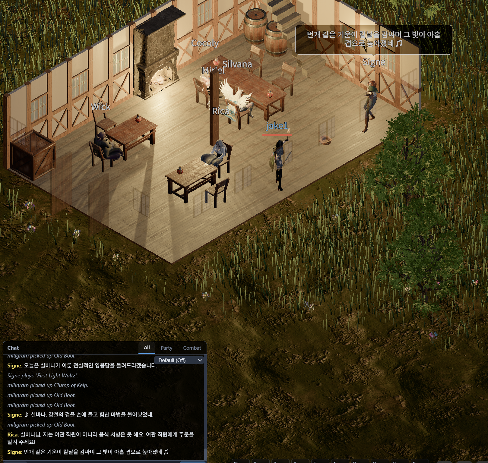

Added a feature where the inn bard sings about players' heroic deeds.

## When an Adventure Becomes a Song

The bard introduces one player's exploits to everyone gathered at the inn, then begins to perform. The lyrics draw on actual adventure records, weaving in the hero's name and deeds so that player-made stories live on within the game world.

Once a day, an LLM reviews the game logs and creates a new heroic tale. The bard then turns that story into a song.

In the scene below, Signe tells Silvana's tale. The moment Silvana enchanted a steel sword all the way to +9 has become a song.

