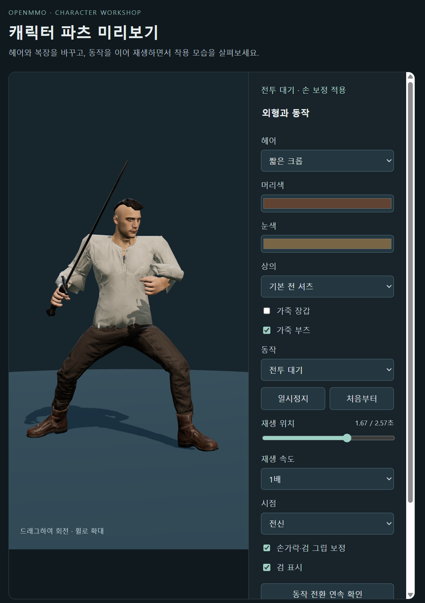
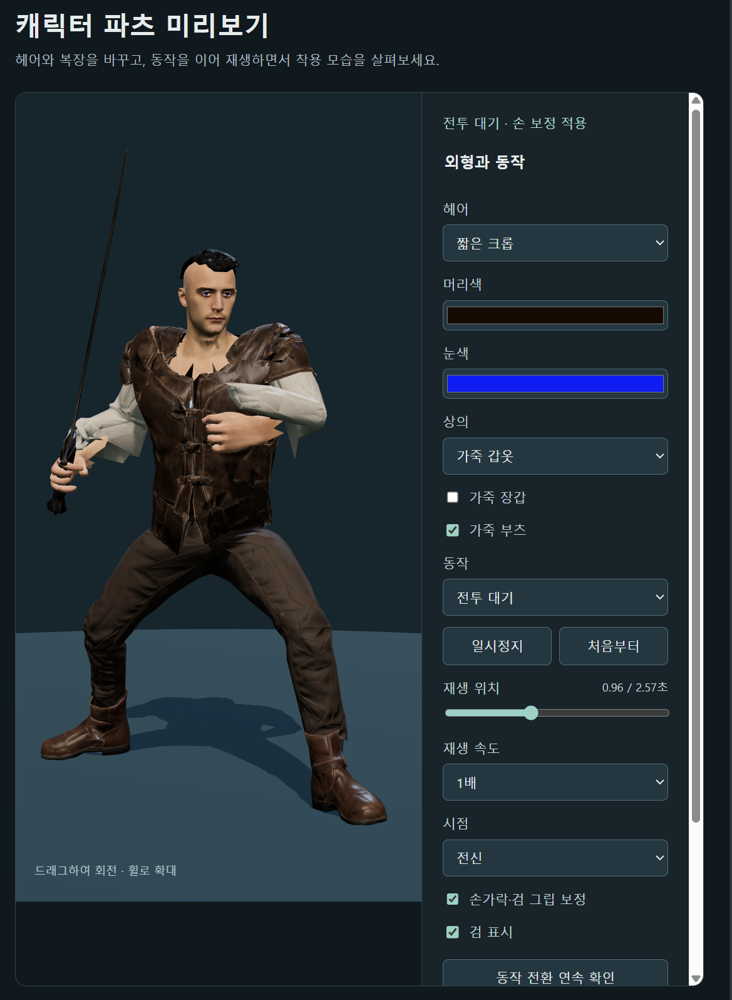
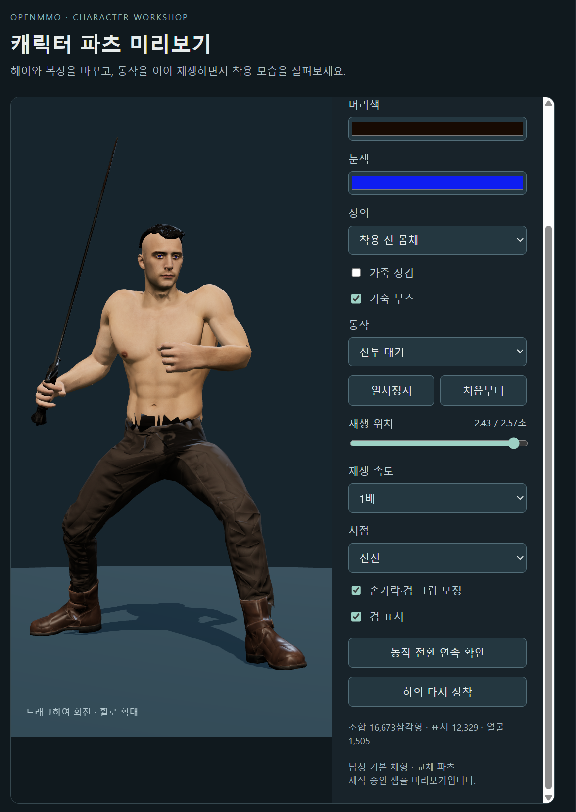
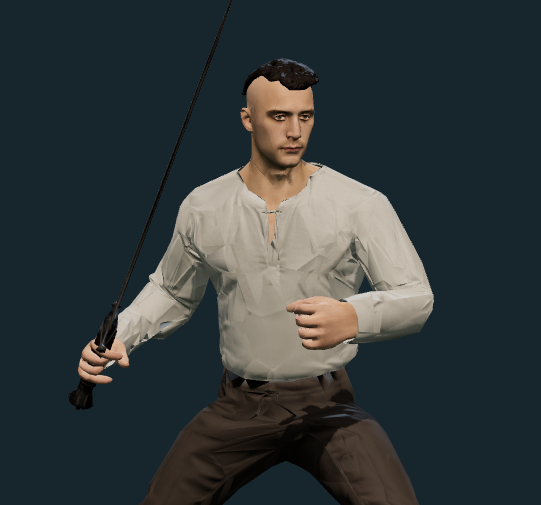
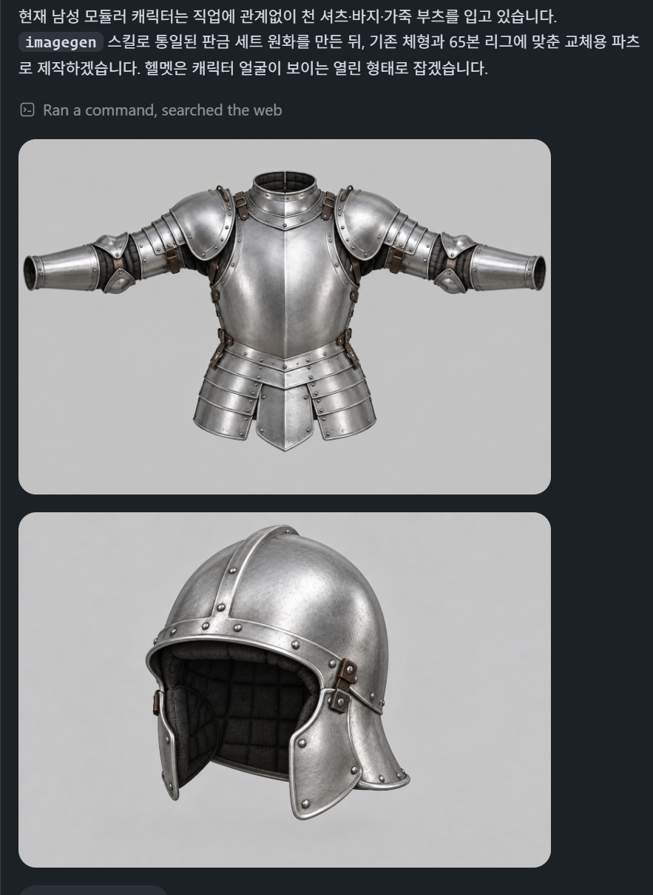
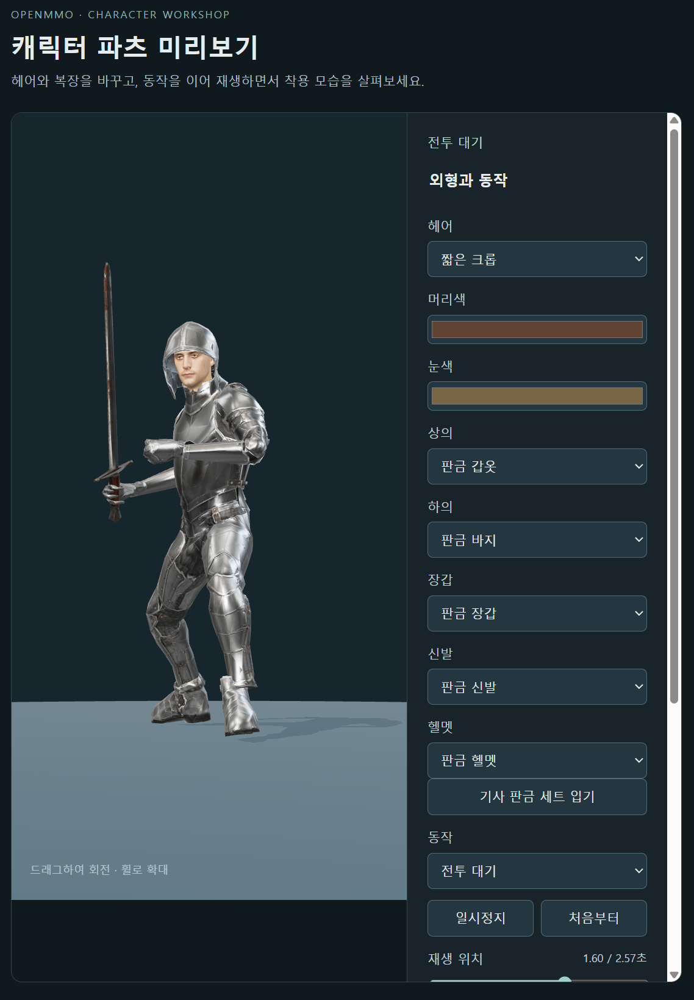
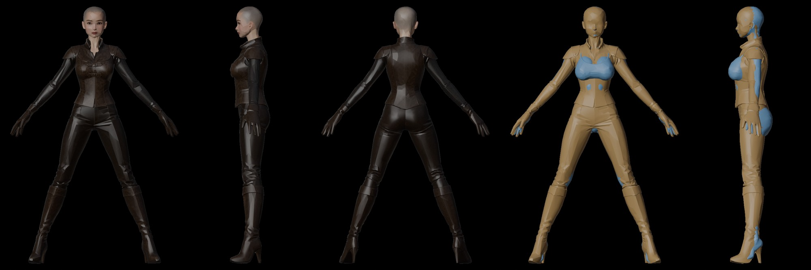
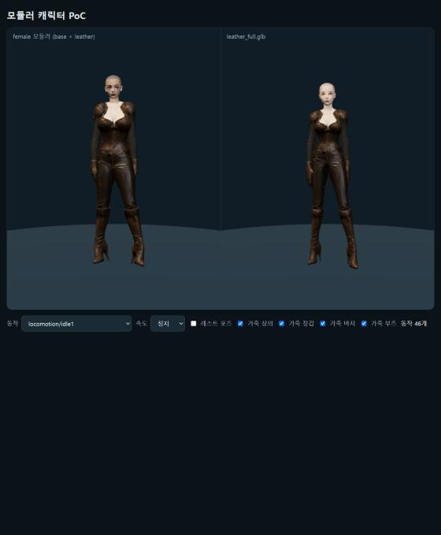
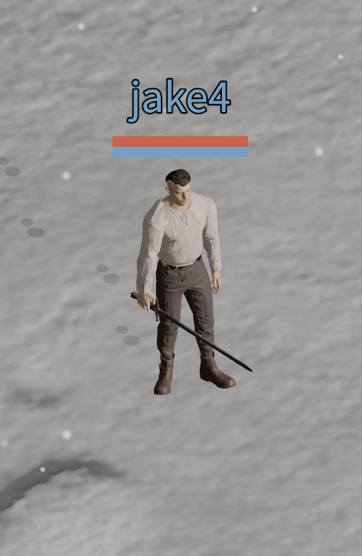

I built a modular character by creating separate assets for each body part and assembling them. The goal was to let players customize their character's appearance by swapping and combining parts.

At first, I wasn't sure whether either Astra or Opus 5.5 could handle this task. I didn't know which would do better, so I gave both models the same job with the same prompt.

Here is the initial prompt I gave both models, translated from Korean:

> Right now, the character is a single mesh. Could we split it into multiple parts for character customization? For example, assemble a character from parts such as hair (with hairstyle and color choices), eyes (with a choice of eye color), upper-body armor, gloves, pants or a skirt, and shoes or boots. The appearance of the parts should also change depending on the items equipped. You would create the concept art yourself, use meshy.ai to generate the meshes, and use Mixamo for the animations? (Or perhaps get the animations from meshy.ai this time too?) What do you think?

Both models said they could do it and got to work. Astra chose to start with a male character, while Opus 5.5 chose a female character.

In this attempt, Astra succeeded in building the character, while I stopped the Opus 5.5 attempt before it was complete.

## Astra: Fitting Parts to a Base Model

Astra first created a base model, then made separate assets for the parts that would go on it. It adjusted each part to fit the base.

Below is the first preview Astra showed me of the assembled character. The character is wearing a shirt, pants, and boots and playing a combat idle animation.

At this stage, the rigging wasn't quite right in places, including the shirt sleeves and the ankles of the pants, so some parts were misaligned. There was still work to do, but the first result had already reached the point of assembling separate assets into a character and showing it in a preview.

Here is the same character wearing leather armor over the shirt.

Removing both the shirt and leather armor reveals the base model's torso. Below is the character with all upper-body clothing removed, still wearing pants and boots.

Astra continued refining the first assembled version over several iterations. Below is the result after cleaning up the shirt's sleeves and waist. The sleeves that had been misaligned and the rough hem around the waist now looked more natural.

I only had to upload and download files through Mixamo once, to rig the initial base model. I uploaded the base, had it rigged, then downloaded the result and handed it to Astra.

After that, Astra handled the concept art, the rigging of individual parts, and the clothing mesh cleanup itself. I just told it what changes I wanted.

For the plate armor set, Astra started by drawing separate concept art for each piece. Below is the scene where it created the upper-body armor and an open helmet that leaves the face visible.

After drawing the concept art, Astra generated the 3D models using the Meshy API I had connected. It then handled rigging the parts, assembling the character, and producing a preview itself.

Below is the first preview it showed me of that plate armor set. As with the first shirt preview, the wrists and ankles were still slightly twisted in places. Even so, once I had connected the API, it reached this point with the plate set without my direct involvement in the production work.

Astra resized the separately created parts to fit the base model and adjusted their rigging. Rigging connects a model to a skeleton so it follows the skeleton's movements. Assembling separate assets requires getting both their shapes and those movement connections right.

It also fitted two male hairstyles to the head, attaching just the hair parts in each case. Astra adjusted the mesh vertices and rigging so the hair fit the head properly.

Astra could carry the work through from creating the parts to resizing them, adjusting their rigging, and assembling them on the base model. What particularly impressed me was its ability to make separately created assets actually work together.

## Opus 5.5: Trying to Match, Cut, and Join Models

Opus 5.5 created a character wearing a leather armor set and an unclothed character as separate models. Its approach was to overlay the two, then cut out and join individual parts. To make that work, it tried to get the corresponding areas of the two models to match as precisely as possible.

On the left below are front, side, and back views of the model wearing the leather armor set. On the right, the armored and unclothed models are overlaid in different colors for comparison.

There was also a big difference in how much manual work I had to do. Opus 5.5 couldn't handle rigging the individual parts itself, so I repeatedly had to upload models to Mixamo, have them rigged, download the results, and hand them back.

For example, I uploaded the base model to Mixamo, rigged it, and passed back the downloaded result. Then I separately uploaded the leather armor set and went through the same process. With Astra, uploading and downloading had been a one-time task at the start; with Opus 5.5, I had to keep doing it.

Rigging the footwear was particularly difficult. After several iterations, the footwear was attached to the base model's bones, but the ankles still bent awkwardly.

Attaching the hair also proved difficult. When fitting just the hair to the head wasn't working, Opus 5.5 itself decided to switch to cutting at the neck and joining the head to the torso. But the neck connection wasn't smooth, leaving a very noticeable seam. In this attempt, it couldn't do what Astra had done: adjust the vertices and rigging to fit the hair part itself to the head.

Below is the final result after several iterations. The awkward ankle bends and the visible neck seam were still there.

It reached the point of attaching parts, but couldn't resolve the rigging and connection problems well enough to finish the character as intended. I stopped the Opus 5.5 work when it still couldn't get the hair attached properly.

I continued the remaining work with Astra.

## The Character in the Game

I put the finished modular character into the game. Below is the character in the actual game, wearing a shirt, pants, and leather boots.

The video below shows the character changing clothes in the game.

<video controls playsinline preload="metadata" style="width: 100%; height: auto;" aria-label="Changing a modular character's clothes in the game">
  <source src="/videos/blog/modular-character-outfit-changes.mp4" type="video/mp4" />
  <a href="/videos/blog/modular-character-outfit-changes.mp4">Watch the character change clothes</a>
</video>
