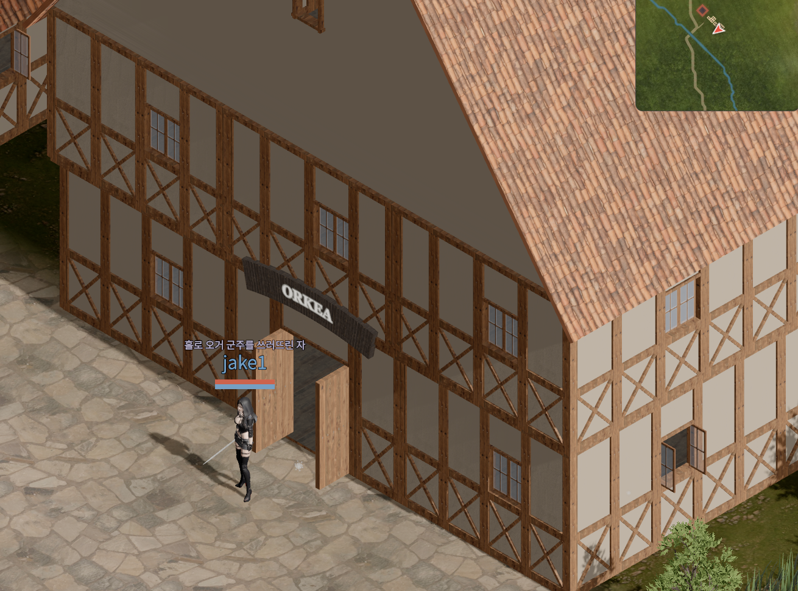
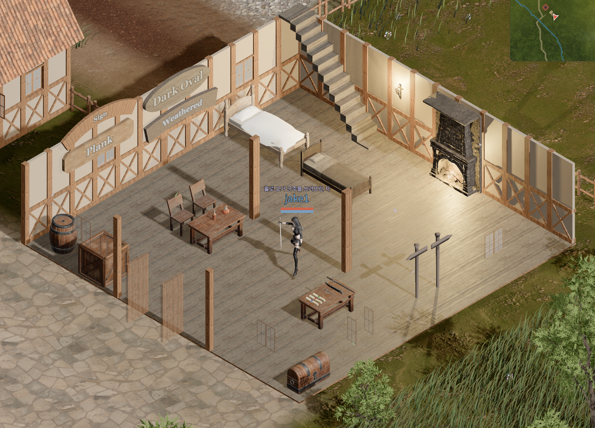
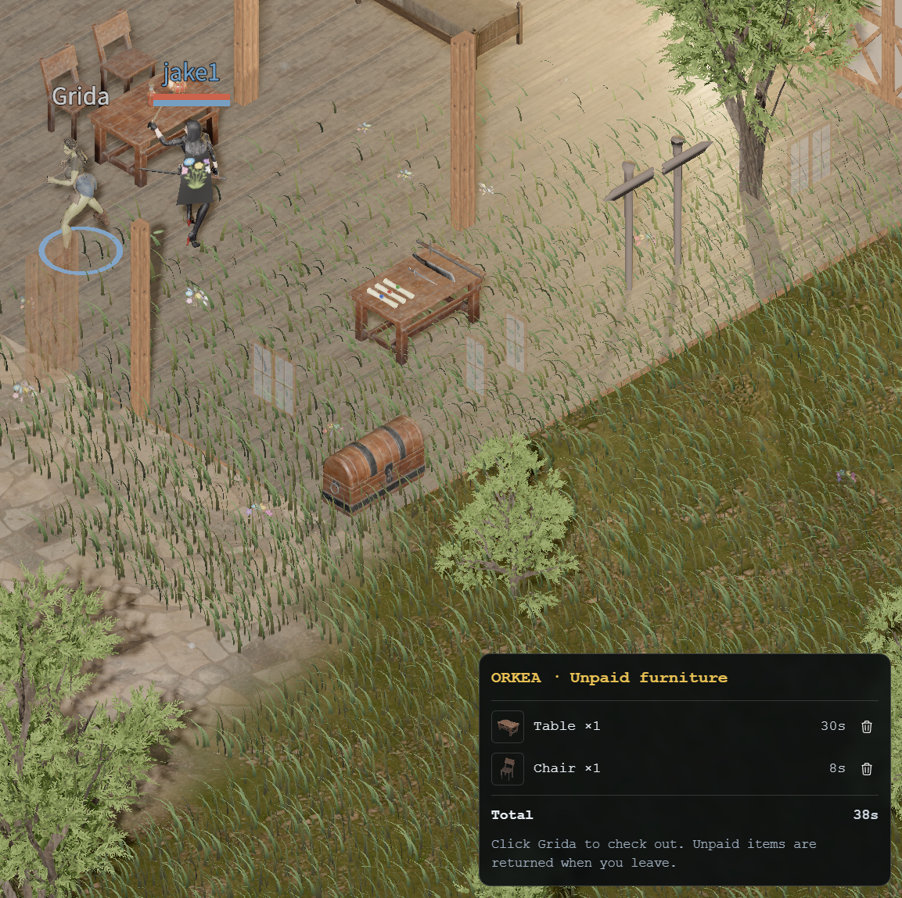
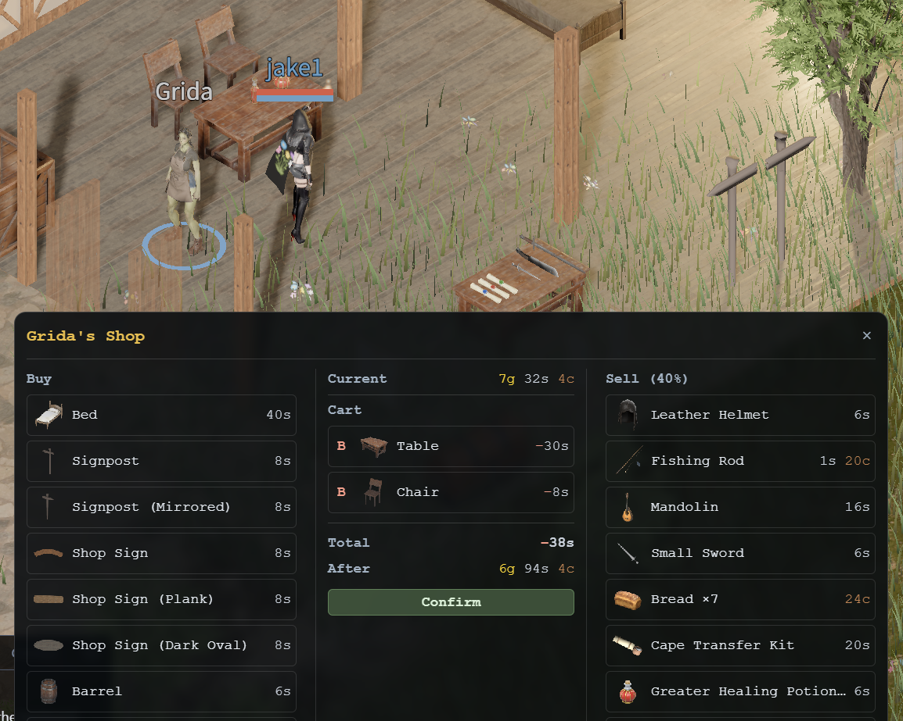
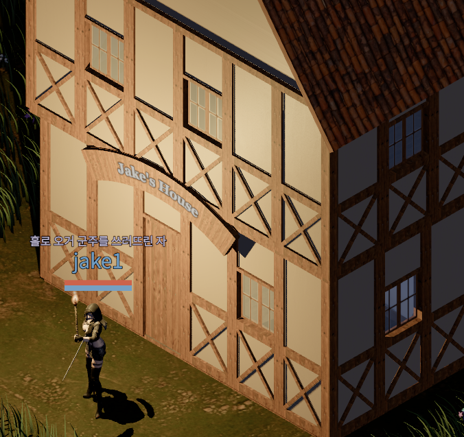
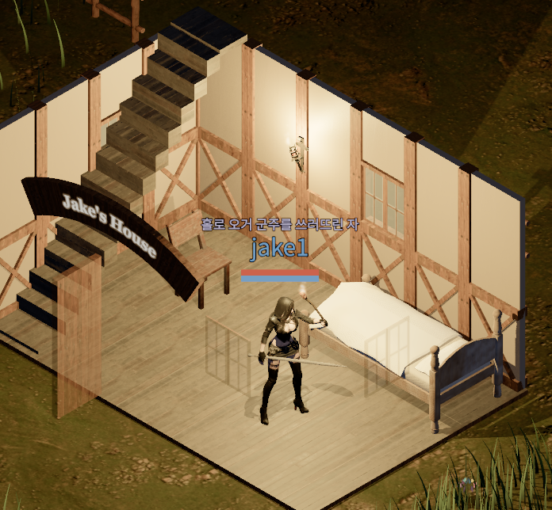

A new furniture store, **ORKEA**, has opened in the game.

The building has timber framing, light-colored walls, and a large tiled roof. An ORKEA sign hangs above the wide-open entrance.

## Choosing Furniture in the Store

Inside, beds, tables, chairs, and other furniture are on display. Walk around the store and click any piece you like to add it to your cart.

## A Table and Chair in the Cart

I added one table and one chair to the cart. The cart shows the quantity and price of each selected piece, along with the total. In the screenshot below, the table costs 30s and the chair costs 8s, bringing the total to 38s.

## Paying Grida at the Entrance

Once you have chosen your furniture, click **Grida** near the store entrance. This opens her shop window, where you can pay for your furniture and take it with you.

## Adding a Sign to the House on My Estate

I also placed a sign on the house on my estate. A wooden sign reading **Jake's House** hangs above the entrance, marking it as my home.

## Placing a Bed, Chair, and Wall Torch

Inside the house, I placed a bed and a chair and mounted a torch on the wall. The wall torch lights up the bed and wooden floor.

