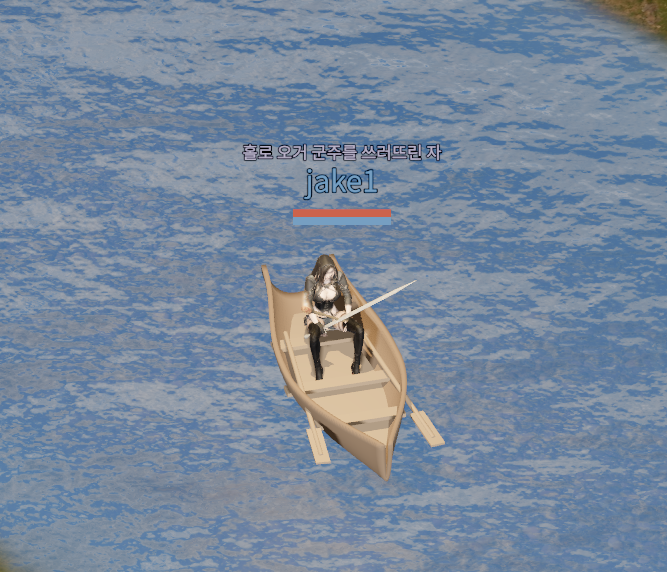
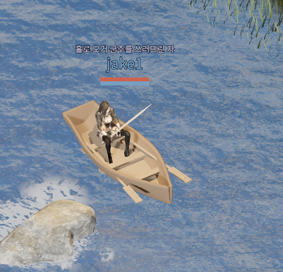
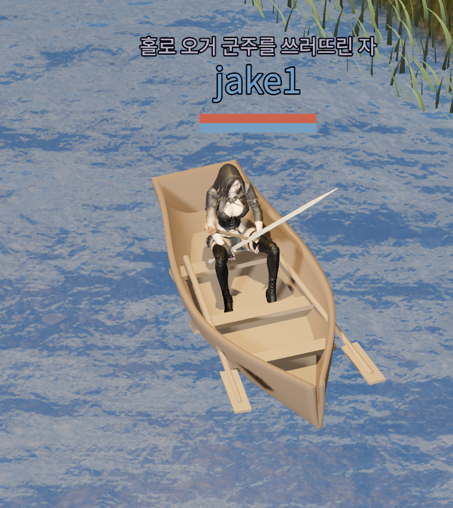
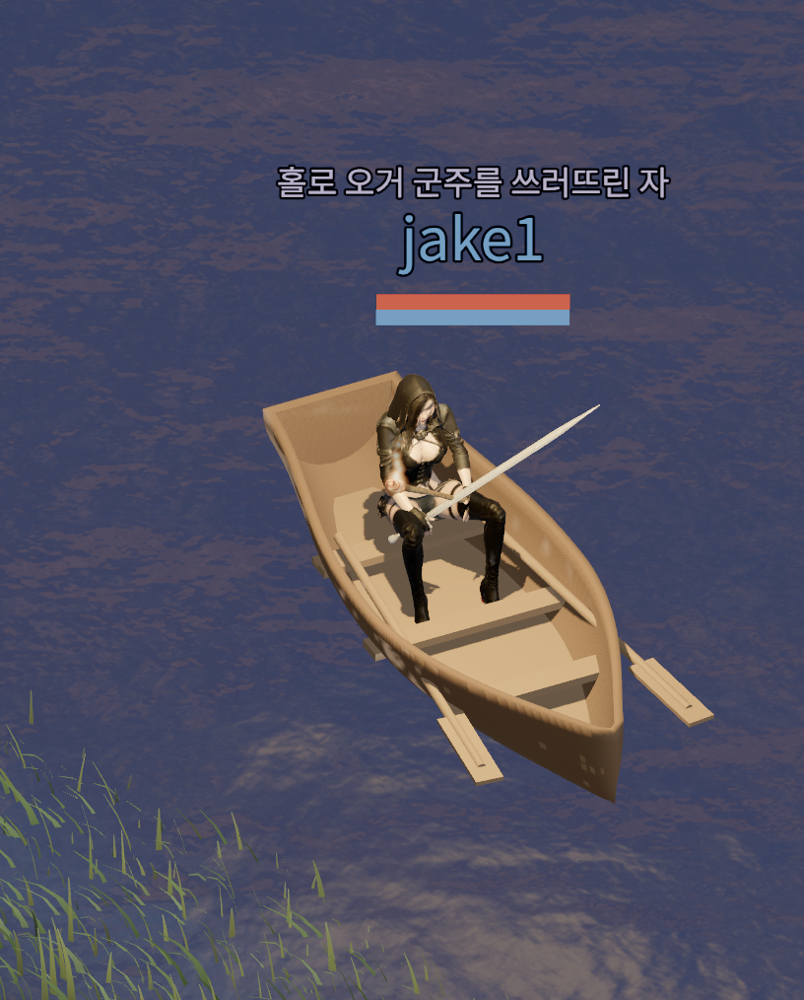
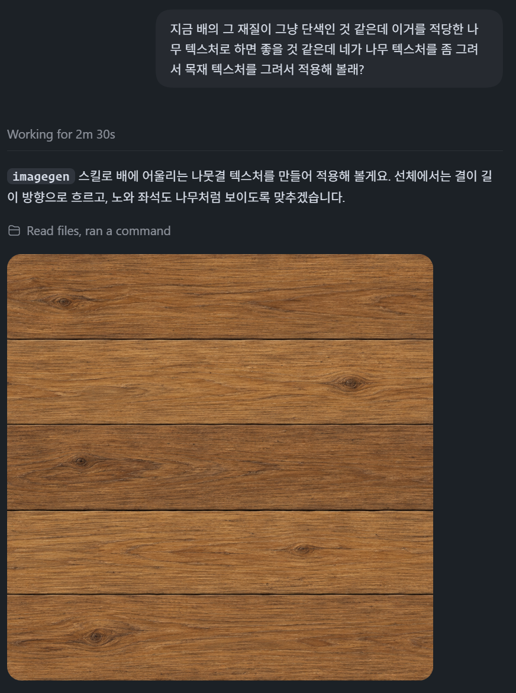
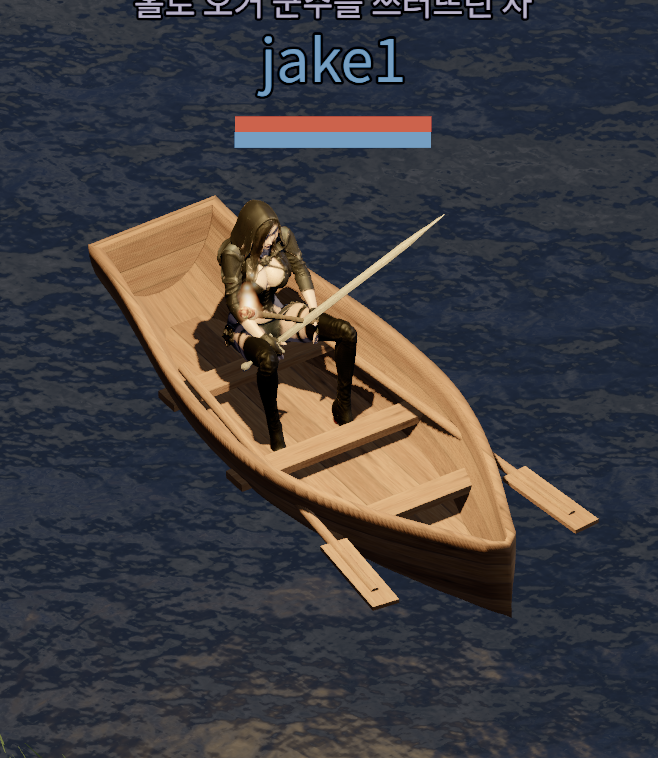
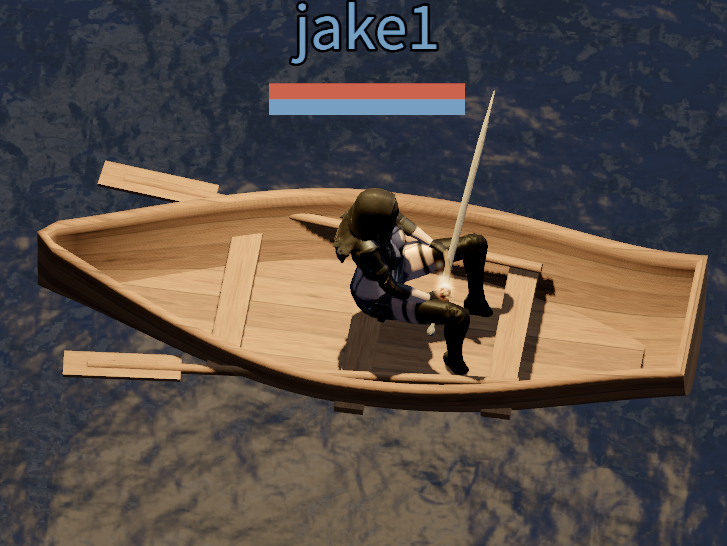

After adding horseback travel on land, we have added a `Rowboat` for traveling on water. Launch it, row to a spot you like, and stop to fish without leaving your seat.

## The First Version

GitHub contributor [letnaturebe](https://github.com/letnaturebe) contributed the first implementation of the rowboat. The screenshot below shows that original version.

Building on this boat, we refined the hull and seating pose and added a wood texture, rowing motion, and water effects.

## Boarding and Leaving the Boat

You can buy a rowboat from Rica for a base price of 1 gold. Stand in water outdoors and use the boat from your bag to board, then use it again to get out. The boat is reusable and is not consumed.

Launching uses the same minimum water depth as fishing. You can board in rivers or the sea where the water is at least 0.1 meters deep, but you cannot launch on dry land. Rowing into water that is too shallow automatically dismounts you.

The boat moves at 1.25 times your speed on foot under the same conditions. It follows the water surface rather than the ground beneath it, and crossing water while aboard does not apply a new wet debuff. Turns follow a small arc.

## Refining the Wooden Boat

The contributed boat model was generated with a Blender script. Three crosswise boards span the interior, with the character seated in the middle. Each oar is a separate part so it can move independently.

The screenshot below shows the boat after adding a board to close the opening at the stern.

A closer look after closing the stern revealed that the two sides of the hull were still slightly separated at the bow. The close-up below shows the remaining gap.

We then joined the two sides at the bow to close the gap and refined the hull's thickness. The screenshot below shows the boat with the bow gap closed.

## Asking Astra for a Wood Texture

At this stage, the boat still had a plain, solid-colored material. I asked Astra to draw and apply a wood texture to give it the appearance of a wooden boat.

Astra used an image generation tool to create a brown oak plank texture. The screenshot below shows the request and the resulting texture.

The grain runs lengthwise along the hull and floor, across the crosswise boards, and along each oar's shaft and blade. The inventory icon was rendered from the same boat model.

The screenshot below shows the boat with the wood texture applied. The grain is visible on the hull, floorboards, crosswise boards, and oars.

## Rowing with Hands and Body

I also asked Astra to create the rowing animation. The video below shows its first version. This was before we changed the seating direction, so the character is still facing the direction of travel while rowing.

<video controls playsinline preload="metadata" style="width: 100%; height: auto;" aria-label="The first rowing animation created by Astra, before turning the seated character to face the stern">
  <source src="/videos/blog/rowboat-first-rowing.mp4" type="video/mp4" />
  <a href="/videos/blog/rowboat-first-rowing.mp4">Watch the first rowing animation</a>
</video>

We then turned the seated character to face the stern, with their back toward the direction of travel, for rowing. The screenshot below shows the revised seating direction.

The video below shows the rowing animation applied to the revised seating pose. The character now rows facing the stern, with their back toward the boat's direction of travel.

<video controls playsinline preload="metadata" style="width: 100%; height: auto;" aria-label="The character rowing while facing the stern, with their back toward the boat's direction of travel">
  <source src="/videos/blog/rowboat-stern-facing-rowing.mp4" type="video/mp4" />
  <a href="/videos/blog/rowboat-stern-facing-rowing.mp4">Watch the rowing animation with the character facing the stern</a>
</video>

We started with the existing chair sitting pose and adjusted the height so the feet reach the floorboards. The rider also follows the boat's gentle rocking.

When the boat starts moving, both oars extend over the sides. Their blades push water toward the stern, then turn flat as they return above the surface. The rowing rhythm changes with movement speed.

The character's hands follow the oar handles. Pulling the handles toward the body also leans the torso back, keeping the arms and upper body in rhythm. Held equipment is hidden while handling the oars.

Stowing the oars immediately after every stop would repeat the whole motion during short movements. Instead, the rider keeps them extended for five seconds after stopping. Moving again during that time resumes rowing; waiting longer slowly stows the oars against the gunwales.

The video below shows the revised resting pose, with the oars held slightly out to the sides after the boat stops.

<video controls playsinline preload="metadata" style="width: 100%; height: auto;" aria-label="The revised animation keeping the oars slightly extended after the boat stops">
  <source src="/videos/blog/rowboat-oar-rest.mp4" type="video/mp4" />
  <a href="/videos/blog/rowboat-oar-rest.mp4">Watch the oars remain extended after stopping</a>
</video>

## The Finished Version with a Wake and Splashes

Forward movement leaves a V-shaped trail of foam spreading from the bow. The foam spreads, fades, and disappears at slightly different times. When the boat stops, the remaining foam fades in place without continuing to grow.

Small droplets and foam appear when an oar blade enters the water. These effects use the actual blade position and water height, so holding the oars out while stationary does not produce new splashes. They also follow the day and night lighting and the water effects graphics setting.

The video below shows the finished version, with a wake as the boat cuts through the water and droplets splashing where the oars meet the surface.

<video controls playsinline preload="metadata" style="width: 100%; height: auto;" aria-label="The finished rowboat with a wake and droplets splashing where the oars meet the water">
  <source src="/videos/blog/rowboat-final-water-effects.mp4" type="video/mp4" />
  <a href="/videos/blog/rowboat-final-water-effects.mp4">Watch the finished rowboat with water effects</a>
</video>

## Fishing from Your Seat

When fishing aboard, the character keeps the lower body seated while the upper body casts and handles the rod. We combined the existing sitting and fishing animations bone by bone, keeping the lower spine with the seated pose so the waist does not bend awkwardly above the hips.

Casting while seated in the boat is now restricted to the stern, the back of the boat where the character is facing. This is straight ahead for the character and opposite the boat's direction of travel. Casting in other directions made the seated pose look awkward, so fishing toward the sides or the bow is no longer allowed.

Clicking nearby water toward the stern with a fishing rod equipped starts fishing. Use the keyboard to move the boat and click to cast; clicking beyond the eight-meter casting range still requests movement. Fishing, attacking, or starting another interaction stows the oars immediately instead of waiting five seconds.

## Combat Restrictions Still to Resolve

Entering combat does not dismount you from the boat, and you can keep moving and steering. However, the existing restriction on using skills and abilities while mounted still applies, leaving only basic attacks available aboard. The rules for combat from a boat still need further work.
