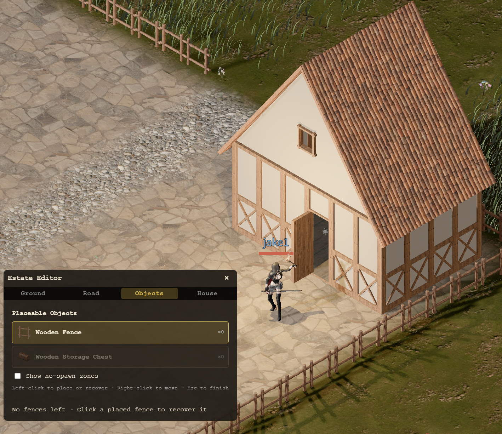

내 땅을 갖게 된 다음에는 그곳을 직접 꾸밀 차례입니다. 이번에는 영지에 울타리를 세우고, 바닥을 바꾸고, 집을 지을 수 있도록 영지 꾸미기 기능을 추가했습니다. 집에는 보관함을 설치해 인벤토리에 넘치는 물건도 보관할 수 있습니다.

아래는 울타리로 공간을 둘러싸고 돌바닥을 깐 뒤 집을 세운 모습입니다.

## 울타리로 공간 나누기

영지에 울타리를 세워 마당의 경계를 잡을 수 있습니다. 집 주변을 감싸거나 원하는 공간을 구분하면서 내 땅의 모양을 만들어 갑니다. 스크린샷에서는 나무 울타리를 따라 마당과 바깥 풀밭이 나뉘어 있습니다.

## 바닥 바꾸기

영지의 바닥도 바꿀 수 있습니다. 집 앞에 돌바닥을 깔아 마당을 꾸미면 주변 풀밭과는 다른 분위기를 낼 수 있습니다.

## 내 영지에 집 짓기

영지에 집을 짓는 기능도 추가했습니다. 집은 총 다섯 종류로, 마음에 드는 집을 골라 지을 수 있습니다. 

## 집에 보관함 놓기

집에 보관함을 설치하고 물건을 넣어 둘 수 있습니다. 모험 중에 모은 물건으로 인벤토리가 가득 찼다면, 당장 쓰지 않는 물건을 집에 보관해 가방 공간을 확보할 수 있습니다.
