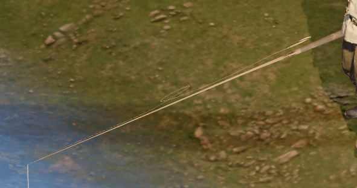
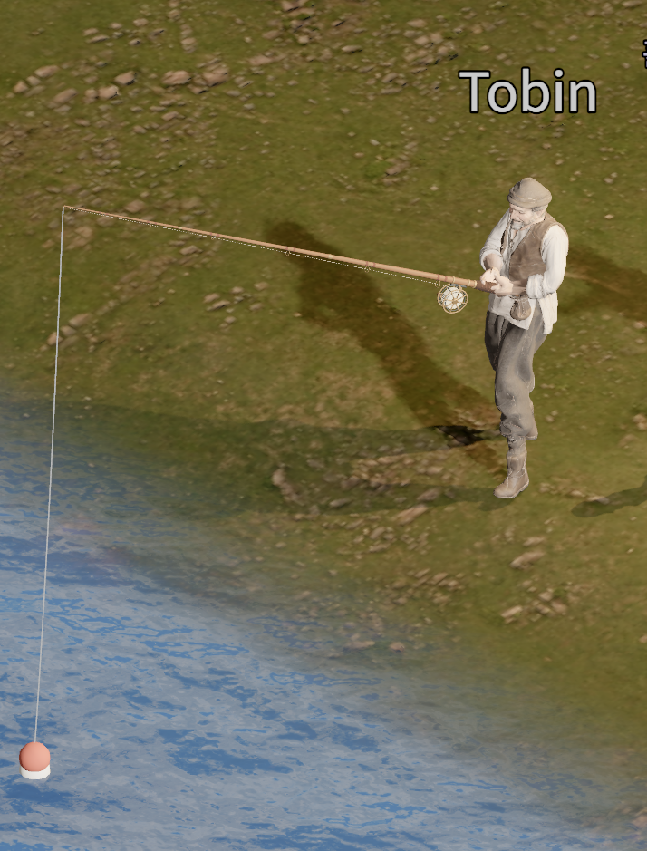
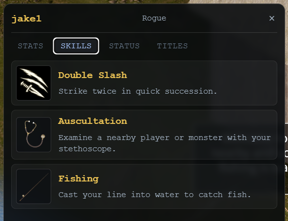

낚싯줄이 어색하게 붙어 있던 기존 낚싯대를 아스트라(Astra)가 새로 만들었습니다. 릴을 풀고 감는 동작과 낚시에 성공했을 때 물고기를 들어 올리는 애니메이션도 함께 만들었습니다.

낚시를 배우는 방식도 바꿨습니다. 기존의 레벨과 경험치를 없애고, 토빈의 낚시를 보며 스킬을 습득하도록 했습니다.

## 기존 낚싯대

아래는 개선 전 낚싯대의 모습입니다. 낚싯줄이 낚싯대에 어색하게 붙어 있고, 중간에는 줄이 고리처럼 꺾여 보이는 부분도 있습니다.

## 아스트라가 만든 새 낚싯대

아래는 아스트라가 새로 만든 낚싯대입니다. 릴과 낚싯줄이 제대로 붙어 있고, 낚싯줄은 낚싯대를 따라 끝까지 이어진 뒤 물 위의 찌로 내려갑니다.

## 릴 조작과 낚시 성공 애니메이션

낚싯줄의 텐션(장력)에 맞춰 릴을 풀고 감는 애니메이션도 추가했습니다. 줄을 풀어 주거나 다시 감아들이는 과정이 캐릭터의 동작으로 드러납니다.

낚시에 성공하면 낚싯대를 들어 올리고, 줄에 매달린 물고기도 함께 들어 올립니다. 릴을 조작하는 동작부터 물고기를 들어 올리는 동작까지 모두 아스트라가 만든 애니메이션입니다.

아래 영상에서 릴을 풀고 감으며 낚시하다가, 낚시에 성공해 물고기를 들어 올리는 모습을 볼 수 있습니다.

<video controls playsinline preload="metadata" style="width: 100%; height: auto;" aria-label="아스트라가 만든 낚시 애니메이션. 낚싯줄의 텐션에 맞춰 릴을 풀고 감으며, 낚시에 성공하면 낚싯대와 줄에 매달린 물고기를 함께 들어 올립니다.">
  <source src="/videos/blog/fishing-reel-and-catch.mp4" type="video/mp4" />
  <a href="/videos/blog/fishing-reel-and-catch.mp4">릴 조작과 낚시 성공 애니메이션 영상 보기</a>
</video>

## 토빈을 보고 배우는 낚시

기존에는 낚시에 별도의 레벨이 있고, 낚시를 하면서 경험치를 쌓는 구조였습니다. 이번에는 낚시 레벨과 경험치를 없애고, 한 번 습득해서 사용하는 스킬로 바꿨습니다.

낚시 스킬은 토빈 옆에서 토빈이 낚시하는 모습을 보고 있으면 습득할 수 있습니다.

아래는 낚시 스킬을 습득한 뒤의 스킬창입니다. 낚싯대 아이콘과 함께 `Fishing`이 스킬 목록에 표시됩니다.

