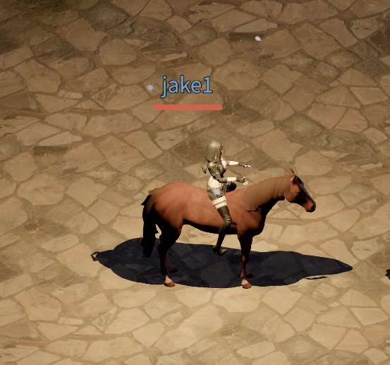

넓은 월드를 조금 더 빠르게 돌아다닐 수 있도록 말 타기를 추가했습니다. 고삐를 사용해 말을 타고, 야외에서 도보보다 3배 빠르게 이동할 수 있습니다. 달리는 말에 맞춰 캐릭터의 자세가 움직이고, 방향을 바꿀 때는 말과 기수가 함께 몸을 돌립니다.

## 처음 말 등에 올라탄 모습

말의 원본 메시 모델과 애니메이션은 MAXDESIGN-3D가 Sketchfab에 공개한 [Horse](https://sketchfab.com/3d-models/horse-6d0f9c1ce82f41048a282b6c47a50684)에서 가져왔습니다. [CC BY 4.0](https://creativecommons.org/licenses/by/4.0/) 라이선스의 에셋으로, 게임에 맞게 크기를 조절하고 애니메이션을 동작별로 나누어 사용했습니다. 애니메이션을 동작별로 나누는 작업은 Codex Astra가 잘 해줬습니다.

아래는 캐릭터를 처음 말 등에 얹었을 때의 스크린샷입니다. 아직 손과 말의 입을 잇는 고삐를 추가하지 않았고, 말의 달리는 동작에 맞춰 캐릭터 애니메이션을 수정하기 전의 모습입니다.

## 고삐로 타고 내리기

리카(Rica)에게 고삐인 `Horse Reins`를 구매할 수 있습니다. 기본 가격은 1골드 50실버입니다. 가방에서 고삐를 사용하면 말을 타고, 다시 사용하면 내립니다. 고삐는 사용해도 소모되지 않으므로 한 번 구매하면 계속 사용할 수 있습니다.

말은 전투 중이 아닌 지상 야외에서 탈 수 있습니다. 건물 내부나 던전, 깊은 물에서는 탈 수 없으며, 말을 탄 상태에서 전투에 들어가거나 이런 장소로 이동하면 자동으로 내립니다. 재접속할 때도 말에서 내린 상태로 시작합니다.

## 더 빠르게, 부드럽게 방향 바꾸기

말을 타면 같은 조건의 도보 이동보다 속도가 3배 빨라집니다. 기존의 길찾기와 충돌 판정을 사용하므로 울타리나 벽은 말을 타고 있어도 그대로 장애물이 됩니다.

방향을 크게 바꿀 때는 작은 원을 그리듯 돌아서 목표 방향을 향하도록 했습니다. 회전하는 동안에는 천천히 움직이고, 진행 방향이 맞아 가면 다시 속도를 올립니다. 클릭 이동과 키보드 이동 모두 이 동작을 사용하며, 회전 도중에도 새 방향으로 바꿀 수 있습니다.

## 말의 움직임에 맞춘 기수 동작

이 캐릭터에는 원래 말을 타기 위한 애니메이션이 없었습니다. 말 등에 앉도록 다리를 벌리는 자세와 고삐를 잡기 위해 손을 드는 자세, 말의 움직임에 맞춰 몸이 위아래로 흔들리는 동작까지 모두 Codex Astra가 새로 만들어줬습니다.

Codex가 이제 코딩뿐 아니라 인간과 같은 도구를 사용해서 애니메이션을 만들고, 모델링을 하고, 음악을 만들고, 그림까지 그릴 수 있다는 걸 보면서, 개인적으로는 이미 AGI에 도달한 게 아닌가 하는 생각이 들었습니다.

말에는 대기, 걷기, 달리기와 좌우 회전 애니메이션을 연결했습니다. 이동 속도에 맞춰 동작과 재생 속도가 바뀌고, 출발하거나 멈출 때도 자연스럽게 이어집니다.

캐릭터는 달리는 말의 보폭에 맞춰 골반과 상체를 움직입니다. 머리와 발이 지나치게 흔들리지 않도록 자세를 보정하고, 멈춰 있을 때는 손을 낮춰 편하게 고삐를 잡습니다. 회전할 때는 상체와 양손이 말머리 방향을 부드럽게 따라갑니다.

양손과 말의 입 사이에는 고삐 두 가닥을 연결했습니다. 손과 말머리가 움직여도 줄이 따라가며, 가운데가 조금 처지는 모양을 유지합니다. 말을 타는 동안에는 손에 들고 있던 무기와 방패, 횃불을 숨기고, 내리면 원래 표시로 돌아갑니다.

아래 영상은 처음 말 등에 얹었던 캐릭터에 기승 동작을 더한 모습입니다. 손과 말의 입 사이에 고삐를 연결하고, 말이 움직이는 박자에 맞춰 캐릭터가 위아래로 흔들리도록 애니메이션을 수정했습니다.

<video controls playsinline preload="metadata" style="width: 100%; height: auto;" aria-label="고삐를 추가하고 말의 움직임에 맞춰 캐릭터가 위아래로 흔들리도록 수정한 기승 영상">
  <source src="/videos/blog/horse-mounts-rider-motion.mp4" type="video/mp4" />
  <a href="/videos/blog/horse-mounts-rider-motion.mp4">기승 동작 영상 보기</a>
</video>

## 월드맵에서 목적지 정하기

먼 곳으로 이동할 때 쓸 수 있는 월드맵 자동 이동도 추가했습니다. 야외에서 월드맵의 목적지 지정 버튼을 누른 뒤 지도 위의 지점을 선택하면 해당 위치로 자동 이동합니다. 말을 타고 목적지를 정하면 넓은 지역을 여행할 때 더 편리하게 이동할 수 있습니다.
