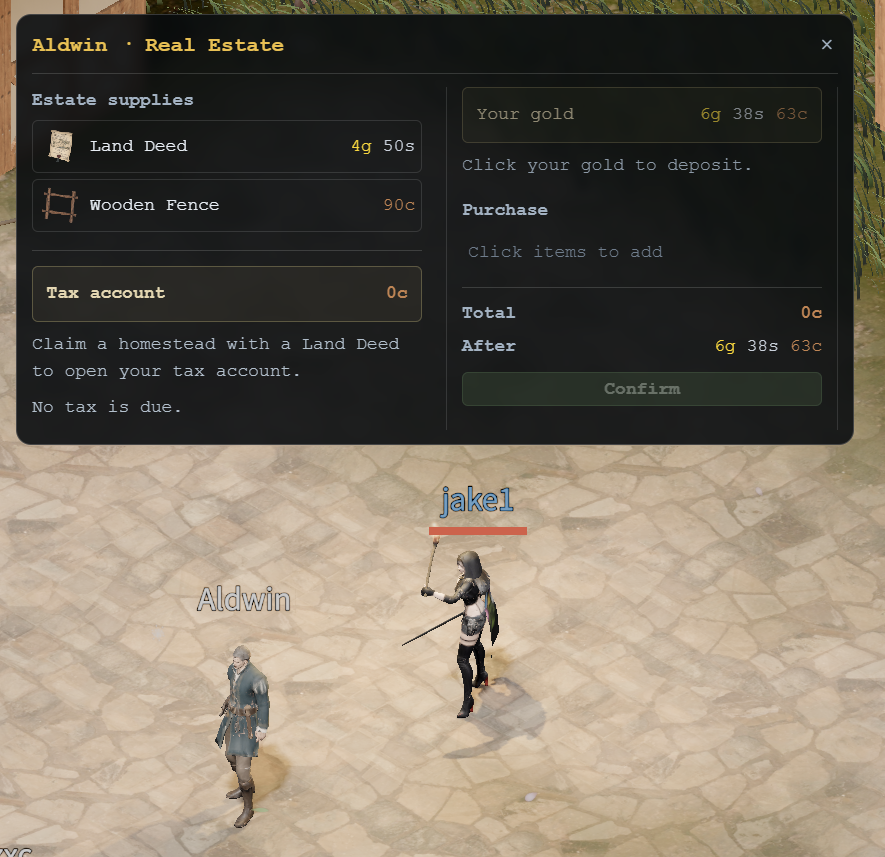
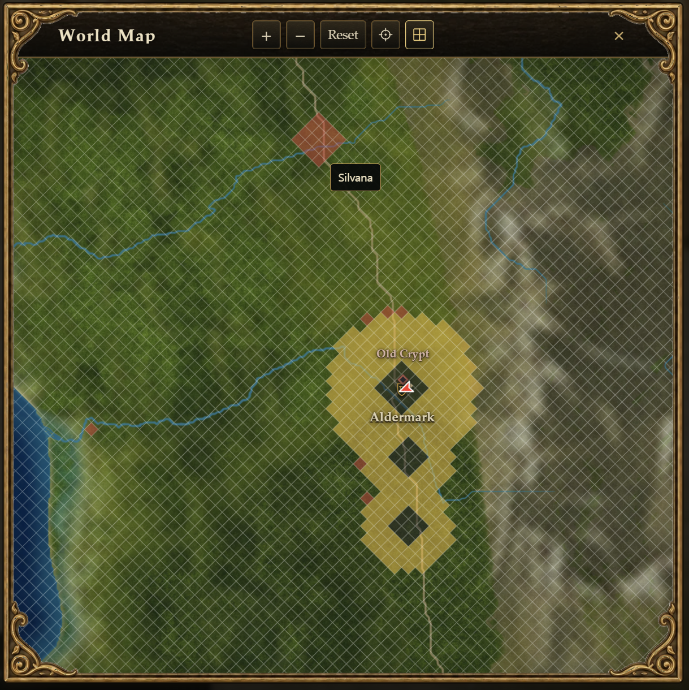
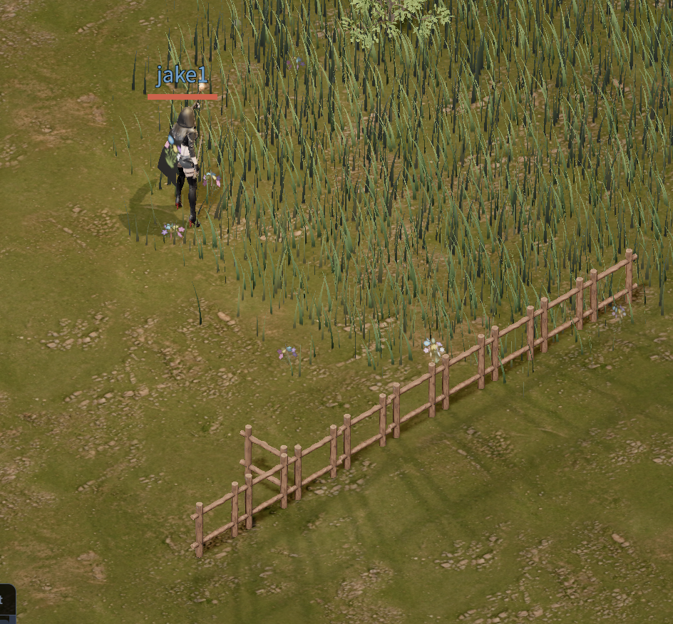

월드의 땅을 직접 소유할 수 있는 영지 콘텐츠를 추가했습니다. 마음에 드는 개척지를 찾아 내 땅으로 등록하고, 주변 구획으로 넓히거나 목책을 둘러 공간을 꾸밀 수 있습니다.

## 땅문서 구매

앨더마크 광장의 영지 관리인 Aldwin에게 땅문서인 `Land Deed`를 구매할 수 있습니다. 기본 가격은 5골드이며, 전용 모델과 아이콘도 추가했습니다.

문서를 구매하거나 보관하는 데는 레벨 제한이 없지만, 영지를 등록하려면 캐릭터가 10레벨 이상이어야 합니다.

## 현장에서 영지 등록

원하는 땅에 서서 가방의 땅문서를 더블클릭하면 현재 구획의 경계와 등록 확인 창이 나타납니다. 한 구획의 크기는 32×32m입니다. 미리보기를 켠 채로 이동하면 새 위치에 맞춰 구획과 등록 가능 여부가 갱신됩니다.

등록할 수 있는 곳은 아직 주인이 없는 개척지입니다. 조건에 맞지 않는 곳에서는 빨간색 격자와 함께 이유를 보여줍니다. 등록을 확정하면 땅문서 한 장이 소모되고, 취소하거나 등록에 실패하면 문서는 그대로 남습니다.

개척지 영지는 계정당 하나를 가질 수 있습니다. 같은 캐릭터가 소유한 영지의 변에 붙은 구획을 추가로 등록하면 최대 16구획까지 넓힐 수 있습니다. 소유권은 저장되어 재접속 후에도 유지됩니다.

아래는 월드맵에 영지가 표시된 모습입니다.

월드맵에서 붉은색은 다른 플레이어가 소유한 영지입니다. 노란색은 앞으로 왕이 영지로 하사할 수 있도록 미리 확보해 둔 땅입니다.

## 세금 계좌 관리

Aldwin의 부동산 관리 화면에서 영지의 세금 계좌를 관리할 수 있습니다. 계좌 잔액, 다음 납기, 예정 세액과 연체 상태를 확인하고 소지금을 입금하거나 다시 출금할 수 있습니다. 납기는 게임 날짜와 실제 남은 시간을 함께 표시합니다.

세금은 게임 내 월초에 계좌에서 자동으로 징수하며, 영지를 처음 등록한 뒤 첫 납기는 면제됩니다. 연체가 생겼다면 미납 세금과 한 달분 세금을 충당할 만큼 계좌를 채워 복구할 수 있고, 복구 후 다음 납기는 면제됩니다.

## 목책으로 꾸미기

Aldwin에게 구매한 목책을 가방에서 더블클릭하면 배치 모드로 들어갑니다. 내 영지에 지형을 따라 1m 격자가 나타나고, 마우스를 움직이면 설치할 위치를 미리 볼 수 있습니다.

빈 격자 변을 클릭하면 목책 하나를 설치하고, 이미 놓인 목책을 클릭하면 회수해 가방으로 돌려받습니다. 미리보기는 설치 가능 위치를 초록색, 회수할 목책을 주황색, 설치할 수 없는 위치를 빨간색으로 표시합니다. 영지 외곽에도 목책을 놓을 수 있으며, 배치한 목책은 재접속 후에도 남습니다.

세금이 미납된 동안에는 새 목책을 설치할 수 없습니다. 기존 목책의 회수는 가능합니다.

