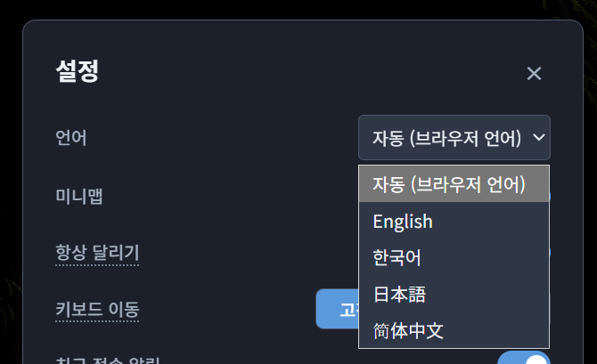

OpenMMO에 한국어·일본어·중국어 간체 번역을 추가했습니다. 기존 영어를 포함해 네 가지 언어를 지원합니다.

## 언어 설정

설정 → 언어에서 사용할 언어를 선택합니다. 기본값인 ‘자동’은 브라우저의 언어 설정을 따르며, 지원하는 언어가 없으면 영어를 사용합니다.

선택한 언어는 같은 브라우저에 저장됩니다. 플레이 중에도 재접속 없이 변경할 수 있습니다.



## 번역 범위

로그인과 캐릭터 생성·선택, 가방과 아이템 설명, 거래, 능력치와 스킬 화면에 번역을 적용했습니다. 친구와 감정 표현 메뉴, 지도와 지명, 전투·낚시 기록과 주요 시스템 안내도 번역했습니다.

일부 문구는 아직 영어로 표시될 수 있습니다.

## 번역 처리

화면 문구는 언어별 파일로 관리합니다. 아이템은 ID를 기준으로 번역된 이름과 설명을 찾아 표시합니다.

번역을 적용한 서버 안내에는 원문과 함께 메시지 코드와 이름 등의 값을 보냅니다. 클라이언트는 선택한 언어의 문구에 값을 넣어 표시합니다. 번역이 없으면 영어 문구나 서버가 보낸 원문을 사용합니다.

거래 중 돈이 부족하다는 안내나 아이템을 사용할 수 없다는 메시지에도 이 방식을 적용했습니다.

## 한국어 조사 처리

아이템 이름을 문장에 넣을 때는 이름에 따라 조사도 달라집니다. ‘검을 주웠습니다’와 ‘도끼를 주웠습니다’처럼, 같은 안내라도 앞말의 받침을 확인해야 합니다.

### 값을 넣은 뒤 조사 선택

한국어 번역 문구에는 조사를 고정하지 않고 `$을`, `$은`, `$이`, `$과`, `$으로` 표식을 사용합니다. 아이템 획득 안내는 다음과 같이 작성합니다.

```json
{
  "system.pickedUpItem": "{{name}}: {{item}}{{amount}}$을 주웠습니다."
}
```

먼저 이름·아이템·수량을 넣고, 그다음 조사 표식을 바꿉니다. 수량이 없으면 `미루: 검$을 주웠습니다.`가 되어 ‘검을’로 표시됩니다. 수량이 ` x2`라면 `미루: 검 x2$을 주웠습니다.`가 되므로, 마지막 숫자를 보고 ‘검 x2를’로 표시합니다. 아이템 이름만 보고 조사를 미리 정하면 수량 뒤의 조사와 맞지 않을 수 있습니다.

이 후처리는 한국어 번역 문구에 적용하며, 화면 문구와 번역을 적용한 서버 안내에서 함께 사용합니다.

### 받침 판별

현대 한글의 완성형 음절은 유니코드에서 초성·중성·종성 순서에 따라 배치되어 있습니다. ‘가’의 코드인 `0xAC00`을 뺀 뒤 `28`로 나눈 나머지가 종성 번호입니다. `0`이면 받침이 없고, `8`이면 ㄹ 받침입니다. 계산 방식은 [유니코드의 한글 음절 분해 규칙](https://www.unicode.org/versions/latest/core-spec/chapter-3/#G56669)을 따릅니다.

판별할 때는 먼저 NFC 정규화로 분리된 한글 자모를 합치고, 끝의 공백과 문장부호를 제외합니다. 따라서 `"검"$을`처럼 따옴표가 있어도 ‘검’의 받침을 확인합니다. 이 처리는 판별용 문자열에만 적용하므로 원문의 표기는 유지됩니다.

| 표식 | 받침 있음 | 받침 없음 |
| --- | --- | --- |
| `$을` | 을 | 를 |
| `$은` | 은 | 는 |
| `$이` | 이 | 가 |
| `$과` | 과 | 와 |
| `$으로` | 으로 | 로 |

‘으로·로’에는 ㄹ 받침 예외가 있습니다. ‘검으로’와 달리 ‘활로’라고 쓰므로, 종성 번호가 `8`일 때도 ‘로’를 선택합니다.

### 구현 코드

아래는 게임에서 사용하는 TypeScript 구현입니다. `finalConsonant`는 받침 번호를 구하고, `resolveKoreanParticles`는 각 표식 앞의 문자열을 확인해 조사를 선택합니다.

```ts
const particles = {
  을: ['을', '를'],
  은: ['은', '는'],
  이: ['이', '가'],
  과: ['과', '와'],
  으로: ['으로', '로'],
} as const

type Particle = keyof typeof particles
const digitFinals = [21, 8, 0, 16, 0, 0, 1, 8, 8, 0]

function finalConsonant(text: string): number {
  const word = text.normalize('NFC').replace(/[\s\p{P}]+$/gu, '')
  const last = word.at(-1) ?? ''
  const code = last.charCodeAt(0)
  if (code >= 0xac00 && code <= 0xd7a3) return (code - 0xac00) % 28
  if (code >= 0x30 && code <= 0x39) return digitFinals[code - 0x30]
  return 0
}

export function resolveKoreanParticles(text: string): string {
  return text.replace(
    /\$(으로|을|은|이|과)/g,
    (_, particle: Particle, offset: number) => {
      const final = finalConsonant(text.slice(0, offset))
      const hasFinal = final !== 0 && !(particle === '으로' && final === 8)
      return particles[particle][hasFinal ? 0 : 1]
    }
  )
}
```

`digitFinals`는 숫자 0~9를 ‘영·일·이·삼·사·오·육·칠·팔·구’로 읽었을 때의 받침 번호입니다. 예를 들어 `1`은 ‘일’의 ㄹ 받침이므로 `8`, `2`는 받침이 없으므로 `0`입니다. 숫자는 전체 수의 읽기를 분석하지 않고 마지막 한 자리로 판별합니다.

### 처리 예시와 범위

위 함수에 문자열을 전달하면 다음과 같이 바뀝니다.

| 입력 | 결과 |
| --- | --- |
| `검$을 주웠습니다.` | 검을 주웠습니다. |
| `도끼$을 주웠습니다.` | 도끼를 주웠습니다. |
| `방패$은` | 방패는 |
| `마나$이` | 마나가 |
| `검$과` | 검과 |
| `검$으로` | 검으로 |
| `활$으로` | 활로 |
| `검 x2$을 주웠습니다.` | 검 x2를 주웠습니다. |
| `1$으로` | 1로 |
| `"검"$을` | "검"을 |

현재는 한글 음절과 숫자에 대해 받침을 판별합니다. 영문 이름이나 이모지의 발음은 추정하지 않으며, 이 경우에는 받침이 없는 쪽의 조사를 선택합니다. 지원하는 다섯 표식만 치환하므로 `$에게`처럼 등록하지 않은 표식은 그대로 남습니다.
