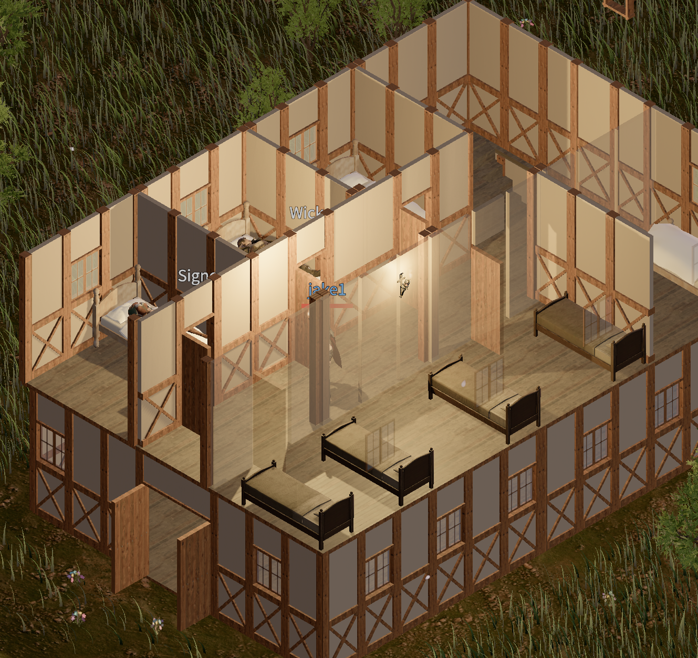

NPC들의 스케줄링을 수정했습니다.

## 여관에서 취침

집이 없는 NPC들은 취침 시간이 되면 여관 2층 방으로 이동해 잡니다.



## 스케줄 이벤트

스케줄을 쉽게 작성할 수 있도록 `breakfast`, `dinner` 같은 이벤트를 추가했습니다. NPC 스케줄에는 시각 대신 이벤트 이름을 지정할 수 있습니다.

아래는 Wick의 `schedule.json` 일부입니다.

```json
{
  "schedule": [
    {
      "at": "dinner",
      "pos": [-1451.7, 1.3, 4750.3],
      "rotation": 90.0,
      "floor_level": 0,
      "label": "eating dinner on the inn's ground floor",
      "action": "chair",
      "object_id": 42
    },
    {
      "at": "breakfast",
      "pos": [-1451.7, 1.3, 4750.3],
      "rotation": 90.0,
      "floor_level": 0,
      "label": "eating breakfast on the inn's ground floor",
      "action": "chair",
      "object_id": 42
    }
  ]
}
```
