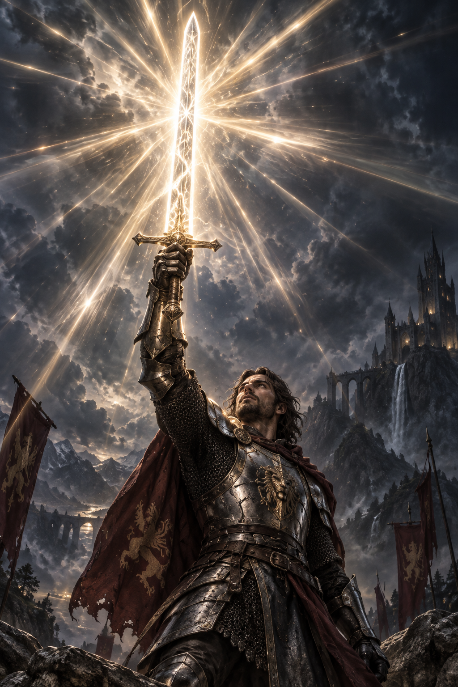

ChatGPT로 아래 이미지를 만들었습니다.

이 이미지를 똑같이 구현해 달라고 아스트라에게 요청했더니, 아래와 같은 인챈트 효과를 만들어 주었습니다.

캐릭터가 똑바로 서서 검을 위로 들어 올리고, 그 검을 살짝 쳐다보는 포즈 애니메이션도 아스트라가 만들었습니다.

<video controls playsinline preload="metadata" style="width: 100%; height: auto;" aria-label="인챈트 효과 영상">
  <source src="/videos/blog/weapon-enchant-effect.mp4" type="video/mp4" />
  <a href="/videos/blog/weapon-enchant-effect.mp4">무기 인챈트 효과 영상 보기</a>
</video>
